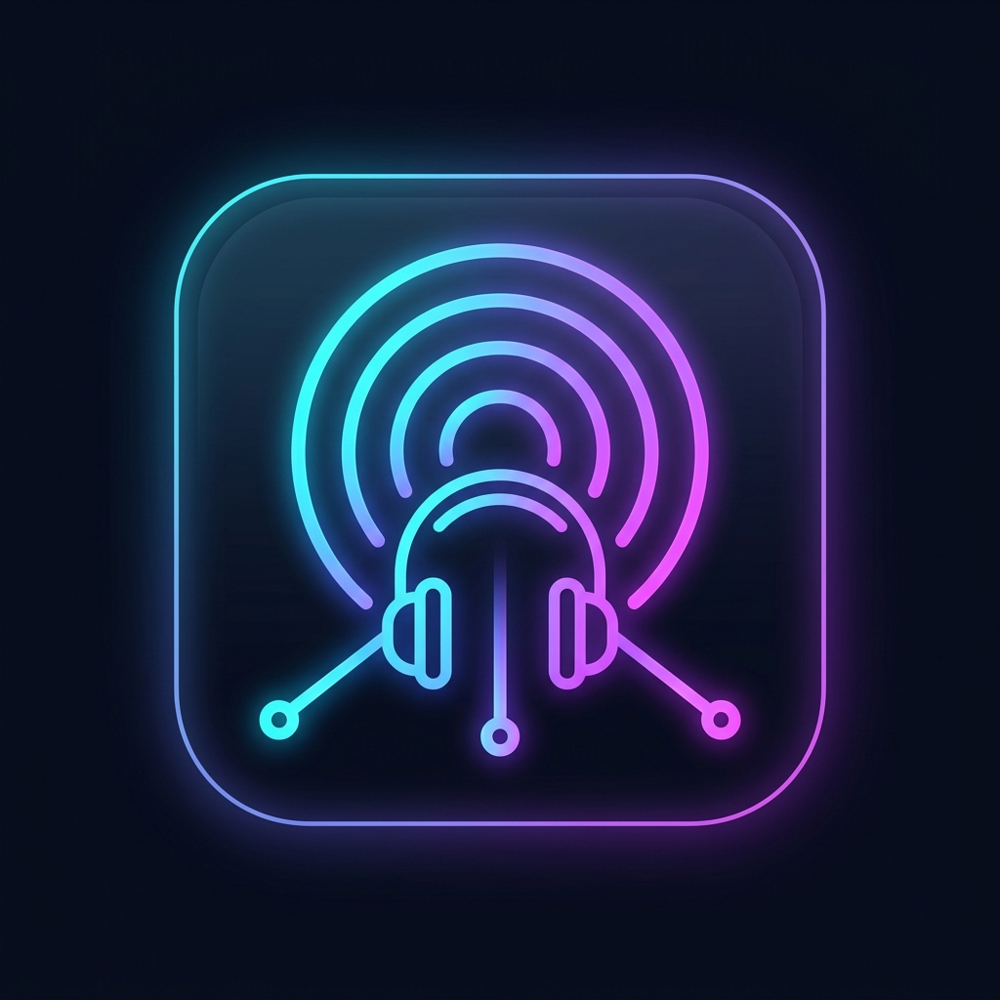
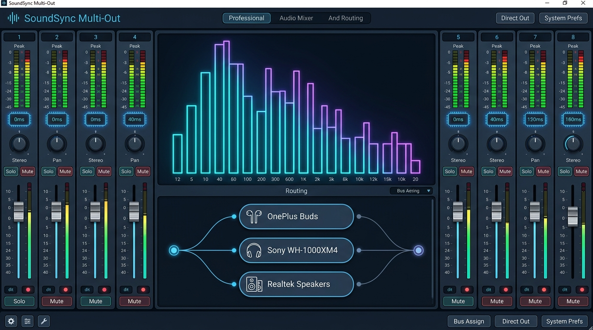
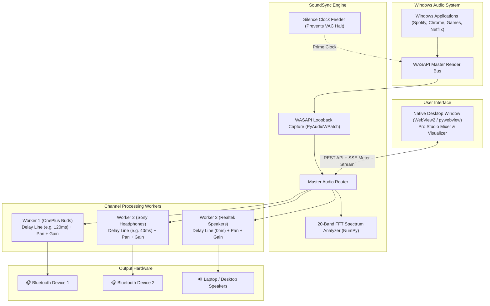

<p align="center">
  
</p>

<h1 align="center">SoundSync Multi-Out 🎛️</h1>

<p align="center">
  <b>Simultaneous Multi-Bluetooth &amp; Multi-Device Audio Router with Micro-Delay Latency Sync for Windows</b>
</p>

<p align="center">
  
  
  
  
  
</p>

---

<p align="center">
  
</p>

---

## 💡 The Problem SoundSync Solves

By default, **Windows restricts system audio playback to a single active sound device at a time**. If you want to connect **2, 3, or more Bluetooth headphones/speakers** to watch a movie with friends, host a silent disco, or play games together, Windows forces you to choose just one device.

Furthermore, different Bluetooth headphones and codecs (SBC, AAC, aptX) have **drastically different wireless latencies** (typically ranging from 40ms to 220ms), resulting in disorienting audio echo when sound is cloned across multiple devices.

**SoundSync Multi-Out** completely solves this:
1. **Captures Windows system audio** in ultra-low latency directly from the Windows WASAPI Loopback bus.
2. **Duplicates the audio stream** in real-time across any number of simultaneous Bluetooth headsets, built-in speakers, USB DACs, and virtual lines (Virtual Audio Cable).
3. **Synchronizes wireless latency** down to the millisecond using circular delay buffers, perfectly eliminating echo across different headphone models.
4. **Presents a pro-studio DAW mixer console** as a native desktop application with live 20-band FFT spectrum visualizer, tactile channel faders, pan dials, solo routing, and master volume controls.

---

## ✨ Key Features

- 🎧 **Simultaneous Multi-Device Streaming**: Connect and stream to 2, 3, or more Bluetooth headphones, earbuds (e.g., AirPods, OnePlus Buds, Sony WH-1000XM), PC speakers, and soundbars at the same time.
- ⏱️ **Sub-Millisecond Delay Compensation (0–500 ms)**: Dedicated latency sliders with quick-sync preset chips (`0ms`, `40ms`, `120ms`, `180ms`) to align wireless packet delays and eliminate echo.
- 📊 **Real-Time 20-Band FFT Spectrum Analyzer**: Fast Fourier Transform logarithmic visualizer with smooth peak-hold physics and left/right stereo peak meters.
- 🎚️ **Pro Studio DAW Channel Strips**: Tactile aluminum-style volume faders (up to 150% boost), stereo pan controls, peak VU meters, **MUTE** (<kbd>M</kbd>), and **SOLO** (<kbd>S</kbd>) isolation routing.
- 🔄 **Dynamic Capture Source Selection**: Switch capture sources on the fly between Windows Default, Virtual Audio Cable (`Line 1`), PC Speakers, or Bluetooth endpoints.
- ⚡ **Virtual Audio Cable (Line 1) Keep-Alive Engine**: Pre-primed silence feeder prevents software audio drivers from halting their clock when silent, ensuring uninterrupted capture.
- 💻 **Native Desktop Application Window**: Runs as a standalone desktop app via Microsoft Edge WebView2 (`pywebview`) without browser address bars, browser tabs, or black command prompt windows.
- 🚀 **1-Click Windows Desktop Shortcut**: Custom glowing waveform desktop icon (`SoundSync Multi-Out.lnk`) for instant launch.
- 📦 **Standalone Executable Included**: Ready-to-use compiled single-file binary [**`dist\SoundSync.exe`**](dist/SoundSync.exe).
- 📱 **PWA & Offline Capable**: Installable directly to the Windows taskbar or Start menu via modern Chromium browsers.

---

## 🏗️ Architecture



---

## 🚀 Quick Start & Launch Options

### Option 1: Desktop Shortcut *(Easiest & Cleanest)*
Double-click the **`SoundSync Multi-Out`** shortcut directly on your Windows Desktop. It launches silently as a native app with no terminal window.

### Option 2: Standalone Compiled Executable
Double-click [**`dist\SoundSync.exe`**](dist/SoundSync.exe). A completely self-contained 32 MB binary that requires zero setup.

### Option 3: Silent Launcher (`launch_app.vbs`)
Double-click [**`launch_app.vbs`**](launch_app.vbs). Launches the application window in the background without a command prompt window.

### Option 4: Batch Launcher (`start.bat`)
Double-click [**`start.bat`**](start.bat) to launch the server and desktop window with terminal logging.

### Option 5: Native Tkinter Desktop GUI
Double-click [**`start_gui.bat`**](start_gui.bat) for the lightweight offline Tkinter GUI fallback.

---

## 📦 Manual Installation (From Source)

### Prerequisites
- **Windows 10 or Windows 11** (64-bit)
- **Python 3.10+** (Python 3.11, 3.12, 3.13 supported)

### 1. Clone the Repository
```bash
git clone https://github.com/dasaradhivarma/sound.git
cd sound
```

### 2. Install Dependencies
```bash
pip install -r requirements.txt
```

### 3. Create Desktop Shortcut (Optional)
```bash
scripts\create_desktop_shortcut.bat
```

### 4. Run the Application
```bash
python run.py
```

---

## ⌨️ Studio Keyboard Shortcuts

| Shortcut | Action | Description |
| :---: | :--- | :--- |
| <kbd>Space</kbd> | **Toggle Broadcast** | Start or stop multi-device streaming |
| <kbd>M</kbd> | **Master Mute** | Instantly silence or restore audio across all channels |
| <kbd>R</kbd> | **Rescan Endpoints** | Rescan Windows for newly connected Bluetooth devices |
| <kbd>T</kbd> | **Harmonic Test Tone** | Play stereo test chime across all active outputs |
| <kbd>1</kbd> – <kbd>9</kbd> | **Toggle Channel** | Quickly enable or disable a specific device channel |
| <kbd>Esc</kbd> | **Clear Solo / Close** | Release active Solo isolation or dismiss modals |

---

## 🎚️ Audio Routing Presets

SoundSync includes built-in one-tap routing presets in the top navigation bar:

| Preset | Description | Settings |
| :--- | :--- | :--- |
| **🎧 Tri-Party** | Stream music to all connected Bluetooth headphones & speakers simultaneously. | 100% volume on all channels, 0ms delay. |
| **🎬 Cinema Sync** | Watch movies and videos together with friends in perfect lipsync. | 120ms delay on Bluetooth devices to match video lipsync, 80% volume on speakers. |
| **⚖️ Balanced** | Comfortable everyday multi-room listening. | Master 100%, 85% balanced gain across all outputs. |

---

## 🔨 Building Standalone Executable (.exe)

You can compile the entire application into a single standalone `.exe` using the bundled builder:

```bash
scripts\build_exe.bat
```
The compiled executable will be placed in `dist\SoundSync.exe`.

---

## 📂 Project Structure

```
sound/
├── docs/                             # Documentation assets & design showcase
│   └── images/
│       ├── soundsync_logo.jpg        # High-res app logo
│       └── soundsync_showcase.jpg    # Application UI showcase banner
├── scripts/                          # Utility & build automation scripts
│   ├── create_desktop_shortcut.bat   # 1-click desktop shortcut generator
│   ├── create_shortcut.ps1           # PowerShell shortcut helper
│   └── build_exe.bat                 # Standalone PyInstaller EXE compiler
├── src/                              # Core Python engine & backend package
│   ├── __init__.py                   # Package initialization
│   ├── audio_engine.py               # WASAPI loopback, circular delay & workers
│   ├── server.py                     # Flask REST API & SSE meter stream
│   └── gui_tkinter.py                # Standalone native Tkinter GUI fallback
├── static/                           # Web & desktop assets
│   ├── css/
│   │   └── style.css                 # Pro Studio DAW design system
│   ├── js/
│   │   └── app.js                    # Mixer controls, SSE meter stream & physics
│   ├── icons/                        # PWA maskable icons (192px, 512px, app_logo)
│   ├── favicon.ico                   # Multi-resolution app icon
│   └── manifest.json                 # Progressive Web App manifest
├── templates/
│   └── index.html                    # Pro Studio DAW mixer interface
├── dist/                             # Compiled standalone executable
│   └── SoundSync.exe                 # Ready-to-use 32 MB binary
├── app_icon.ico                      # Windows application icon
├── launch_app.vbs                    # Silent windowless app launcher
├── requirements.txt                  # Python dependencies
├── run.py                            # Universal desktop launcher (WebView2)
├── start.bat                         # 1-click batch launcher
├── start_gui.bat                     # 1-click Tkinter launcher
└── README.md                         # Documentation
```

---

## 📄 License

This project is licensed under the **MIT License**. Free for personal and commercial use.
